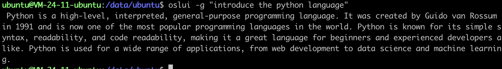

# OSLUI

## 🤔 What is OSLUI?

OSLUI is the natural language user interface of the operating system. The initial computer operating system can only interact with instructions, and with the emergence of graphical interfaces, people can interact with computers through graphic user interfaces(GUI). In the age of intelligence, people should be able to interact with computers through natural language. OSLUI is working to achieve this great goal 🚀🚀🚀.

## 🔧 Quick Install

Currently we only support downloading and installing via pip.

`pip install oslui`

❕OSLUI uses OpenAI's large language model API, you need to set your API Key as an environment variable before using OSLUI.

`export OPENAI_API_KEY=your_openai_api_key`

## 🌰 Use cases

### Interact with OS through natural language

OSLUI will translate natural language command into shell command, and execute them after confirmation or modification by the user.

### Chat with GPT

Users can interact with GPT through OSLUI(need to add "-g" parameter).

## 🚀 TODO

- [ ] Add error and exception handling
- [ ] Support querying external data through OSLUI
- [ ] Add a memory module to support OSLUI understand the context
- [ ] Support plug-in mechanism

